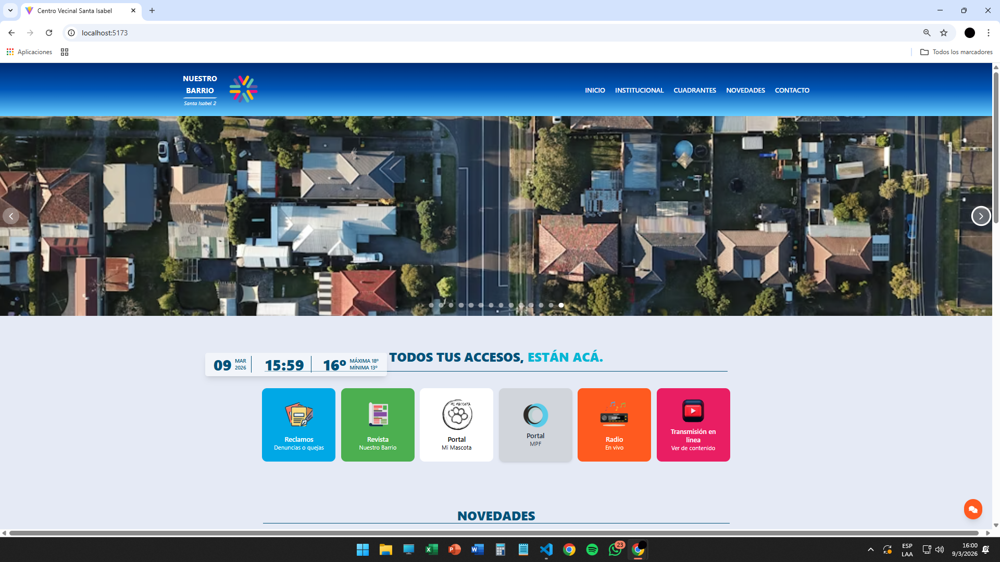

# 🏘 Centro Vecinal Santa Isabel II

Aplicación web desarrollada con **React y Vite** para visualizar y gestionar información de un centro vecinal.  
El sistema permite mostrar novedades del barrio, mascotas perdidas o encontradas, galería de imágenes y banners informativos.

---

# 🚀 Características

## 📰 Gestión de Novedades
- Listado de noticias y novedades del barrio
- Visualización de imágenes asociadas
- Consumo de datos desde una API REST

## 🐶 Portal de Mascotas
- Listado de mascotas perdidas o encontradas
- Información de contacto
- Visualización de imágenes

## 🖼 Galería de Imágenes
- Visualización de imágenes del barrio
- Vista ampliada de imágenes

## 📢 Gestión de Banners
- Banners informativos en la página principal
- Sección de empresas auspiciantes

---

# 🛠 Tecnologías Utilizadas

## Frontend
- React
- Vite
- Axios
- React Router
- TailwindCSS

## Backend (API)
- Node.js
- Express
- Sequelize
- MySQL

---

# 📂 Estructura del Proyecto
```
proyectocentrovecinal
│
├── src
│ │
│ ├── componentes
│ │ ├── admin
│ │ └── layout
│ │
│ ├── imagenes
│ │
│ ├── paginas
│ │
│ ├── styles
│ │
│ ├── App.jsx
│ ├── config.jsx
│ ├── index.css
│ └── main.jsx
│
├── index.html
├── package.json
├── tailwind.config.js
└── README.md
```


---

# 📌 Funcionalidades principales

✔ Visualización de novedades del barrio  
✔ Portal de mascotas perdidas o encontradas  
✔ Galería de imágenes  
✔ Sistema de banners informativos  
✔ Consumo de API REST mediante Axios  
✔ Arquitectura organizada por componentes y páginas  

---

# 📷 Vista de la aplicación



---
